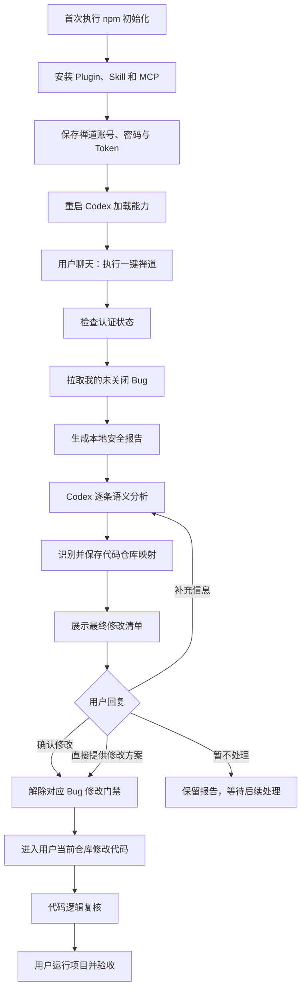

# One-Click-Repair 完整工作流程

本文说明 One-Click-Repair 从首次安装、禅道 Bug 拉取、Codex 语义分析、仓库映射、
修改授权到用户验收的完整流程，以及每个环节负责和禁止做的事情。

## 1. 整体流程



简化后的主链路是：

```text
一次命令安装
→ 日常聊天触发
→ MCP 安全拉取
→ 本地报告缓存
→ Codex 逐条分析
→ 仓库映射
→ 展示预览
→ 用户一次授权
→ Codex 修改
→ 代码逻辑复核
→ 用户运行验收
```

## 2. 首次安装

新用户执行：

```bash
npx one-click-repair@latest setup
```

也可以直接提供禅道地址：

```bash
npx one-click-repair@latest setup --base-url https://你的禅道地址/zentao
```

初始化器依次完成：

1. 自动查找 Codex CLI、Codex Desktop 内置 CLI，或者 VS Code、VS Code Insiders、
   Cursor、Windsurf、VSCodium 中 `openai.chatgpt` 扩展自带的 CLI。
2. 将 npm 包中的 Plugin 复制到稳定目录
   `~/.codex/one-click-repair/marketplace/`。Codex 后续不会指向项目源码目录、`npx`
   临时缓存或 npm cache。
3. 注册 `one-click-repair` Marketplace，安装或更新 Plugin，使 Codex 获得 Skill 和
   STDIO MCP Server。
4. 在 Codex 用户目录生成禅道配置。
5. 询问禅道登录账号，并通过 macOS 系统钥匙串的安全界面询问密码。
6. 调用 `POST /api.php/v1/tokens` 验证账号密码并生成短期 Token。
7. 迁移并备份旧的同名独立 Skill，避免新旧流程同时触发。

凭据保存方式：

- 账号保存在权限为 `0600` 的本地文件中；
- Token 保存在权限为 `0600` 的本地文件中；
- 密码只保存在 macOS 系统钥匙串；
- 密码和 Token 不写入项目源码、配置正文、报告、日志或 MCP 返回值。

初始化完成后，需要完全退出并重新打开 Codex，才能加载新的 Plugin、Skill 和 MCP。

如果无法自动找到 Codex CLI，可显式指定：

```bash
CODEX_CLI_PATH="/自定义位置/codex" npx one-click-repair@latest setup
```

## 3. 日常聊天入口

以后不需要再运行命令行，用户直接在 Codex 中输入：

```text
执行一键禅道
```

也可以说“拉取我的禅道 Bug”“分析禅道 Bug”或“分类并修复 Bug”。Skill 会进入预览
阶段。首次提出这类请求只授权拉取和分析，不授权修改业务代码。

## 4. 认证状态检查

Codex 首先调用 `zentao_auth_status`，检查：

- 本地配置是否存在；
- 禅道账号是否已经初始化；
- Token 是否存在；
- 是否需要用户重新执行 `setup`。

该工具不返回账号正文、密码、Token 或钥匙串内容。

如果正常 API 请求返回 `401`，MCP 会：

1. 从 macOS 钥匙串读取密码；
2. 使用本地账号重新登录禅道；
3. 获取并保存新 Token；
4. 将原只读请求自动重试一次。

自动刷新只执行一次，避免无限登录重试，也不需要用户再次输入账号和密码。

## 5. 拉取个人 Bug

Codex 调用 `zentao_list_my_bugs`，Skill 固定优先使用精简返回：

```json
{
  "response_mode": "summary",
  "limit": 100
}
```

对于禅道开源版 21.6，MCP 依次：

1. 使用初始化时保存在 macOS 钥匙串中的账号密码建立一次临时 Web Session；
2. 直接读取禅道“指派给我”页面 `my-work-bug-assignedTo--id_desc.html`；
3. 按个人列表的分页信息取完候选项，并再次过滤已关闭、改派和重复 Bug；
4. 仅对这些候选项并发请求 `GET /api.php/v1/bugs/{bugId}`，补充完整详情。

这个默认路径不会请求产品列表，也不会遍历开发者无关的产品 Bug。Web Session Cookie 和
密码仅存在于本次 MCP 调用的内存中；密码不写入报告、配置或日志。详情接口继续使用
Token，接口返回 `401` 时仍只自动刷新一次。

拉取结果会返回并持久化：

- `requestSummary.listMode`：默认是 `assigned-to-me`；
- `personalCandidateCount`、`detailRequests`、`restApiRequests` 和 `retryCount`；
- `timings.authenticationMs`、`personalListMs`、`detailsMs` 和 `totalMs`。

MCP 同时发送“建立个人会话、读取列表、读取详情 x/y”等阶段日志。若实例页面经过深度
定制而无法读取，可显式设置 `source.personalBugListMode: "product-scan"` 使用旧的全产品
兼容路径；程序不会因个人列表失败而静默扫描全部产品。

统一后的 Bug 信息包括：

- ID、标题、描述和复现步骤；
- 评论、附件和禅道链接；
- 产品、禅道项目、所属执行和模块；
- 影响版本和解决版本；
- 状态、指派人、严重程度和优先级；
- 代码仓库线索及其来源。

### 5.1 批量部分成功

默认个人列表入口失败时，本次拉取终止，因为无法证明个人 Bug 清单是否完整。

单个 Bug 详情失败时，其他 Bug 继续处理。详情失败项保留列表基础信息并标记：

```json
{
  "fetchStatus": "detail_failed",
  "triage": {
    "decision": "BLOCKED"
  }
}
```

在显式 `product-scan` 兼容模式下，单个产品列表失败时其他产品仍继续处理。报告中的
`fetchSummary` 和 `sourceErrors` 会记录成功数量、详情失败数量、数据源失败
数量、HTTP 状态、错误类型和是否可重试。错误记录不保存响应正文、Token 或带查询
参数的敏感 URL。

临时错误采用指数退避；响应包含合法 `Retry-After` 时优先遵守该值。`401` 仍只触发
一次 Token 自动刷新。

## 6. 本地安全报告

默认运行数据位于：

```text
~/.codex/zentao-frontend-bugfix/
├── config.json
├── secrets/
│   ├── zentao-account
│   └── zentao-token
└── output/
    ├── triage.json
    ├── triage.md
    ├── bugs/
    │   ├── 90001.md
    │   └── 90002.md
    └── workspaces/
```

其中：

- `triage.json` 是 MCP 使用的完整结构化报告；
- `triage.md` 是供用户阅读的分组汇总；
- `bugs/{id}.md` 是每个 Bug 的完整本地明细；
- `workspaces/{id}.json` 记录授权后的仓库选择和复核模式。

报告使用 `schemaVersion: 2`。旧版 Schema 1 报告在读取时自动兼容，不修改禅道配置、
凭据或仓库映射。

安全写入规则：

- 报告目录权限为 `0700`；
- JSON、Markdown 和 workspace 元数据权限为 `0600`；
- 先在同一目录写临时文件，再通过 `rename` 原子覆盖目标文件；
- 每次读取或写入现有报告时修正权限；
- 完整清单刷新成功后，只保留当前清单中的 `bugs/{id}.md`；
- 单 Bug 报告不会误删其他历史 Bug 明细；
- 配置、账号、Token 和当前报告不会被清理。

这些文件只存在于用户本机，不进入 npm 包。

## 7. 精简 MCP 上下文

`summary` 模式只向 Codex 返回：

- Bug ID 和标题；
- 代码仓库线索及来源；
- 所属执行和影响版本；
- 关键词预分诊；
- 详情获取状态；
- 图片附件数量。

如果 Bug 超过当前页，返回 `nextCursor`。Codex 使用游标继续分页时只读取当前本地报告，
不重新请求禅道。这样可以减少 MCP 返回大小、Codex 上下文占用和重复网络请求。

旧调用不传 `response_mode` 时仍使用 `full`，保持向后兼容。

## 8. 按 Bug 读取详情

Codex 对每个摘要调用 `zentao_get_bug_detail`，传入 Bug ID 和本次 `reportPath`。

查询顺序固定为：

1. 优先读取调用方传入的当前报告；
2. 未传时读取默认 `triage.json`；
3. 报告存在该 Bug 且没有设置 `refresh: true` 时直接返回本地详情；
4. 报告缺少该 Bug，或者显式刷新时，只请求该 Bug 的详情接口；
5. 将最新结果原子合并回当前报告，并保持原有顺序、AI 分析和聊天补充。

单 Bug 直查支持：

- ZenTao v1：`GET /api.php/v1/bugs/{bugId}`；
- Fixture：直接按 ID 查找；
- 通用 REST：使用 `source.detailUrlTemplate`，没有模板时返回明确配置错误。

直查后必须验证 Bug 未关闭、仍指派给当前账号且指派人有效，否则不进入修改流程。

如果此前没有报告，会创建：

```json
{
  "scope": "single-bug",
  "completeList": false
}
```

它只代表单项查询结果，不会伪装成完整个人 Bug 清单。

## 9. 按需读取图片附件

Bug 详情中的 `files` 数组或对象，以及描述、复现步骤、评论富文本中的 ``，会在
清除 HTML 前统一为安全附件元数据，包括稳定附件 ID、名称、MIME、大小和实例实际提供
的下载线索。同一图片同时出现在 `files` 和富文本时按文件 ID 或地址去重。

只有截图会影响问题理解时，Codex 才调用 `zentao_get_bug_attachment`。该工具：

- 只接受报告中该 Bug 已经声明的附件 ID，不接受任意 URL；
- 下载地址只使用附件中的 `downloadUrl`、`url`、`webPath`，或者显式配置的
  `source.attachmentUrlTemplate`；
- 只支持 PNG、JPEG、WebP 和 GIF；
- 默认最大 5 MiB；
- 拒绝 SVG、未知类型、扩展名伪造、内容魔数不一致和超限文件；
- 下载 URL 和每一次重定向都必须与禅道 `baseUrl` 同源；
- 禅道为同一主机生成 HTTP 图片地址而配置使用 HTTPS 时，只允许升级到配置中的 HTTPS
  协议和端口；不同主机、非默认 HTTP 端口及跨域重定向仍拒绝；
- Token 只发送给同源地址，附件请求 `401` 时只自动刷新一次；
- 图片只在内存中下载并作为 MCP image 内容返回；
- 不写入磁盘、不加入长期缓存，结构化元数据不包含 base64。

如果实例没有返回可用下载字段且没有配置模板，工具会明确返回“不支持下载”，不会猜测
旧版会话接口。

## 10. Codex 逐条语义分析

Codex 根据标题、描述、复现步骤、评论和必要截图，逐条整理：

1. 主要是什么问题；
2. 实际表现、预期表现和两者差异；
3. 属于逻辑、样式还是需求问题；
4. 是否存在会改变实现方向的确认点；
5. 判断依据和证据；
6. 建议修改方式；
7. 风险是 `low`、`medium` 还是 `high`。

语义分析结构示例：

```json
{
  "bug_id": "90001",
  "summary": "筛选条件切换后没有刷新列表",
  "problem_type": "逻辑",
  "subtype": "状态同步",
  "needs_confirmation": true,
  "confirmation_question": "切换条件后是否应立即请求接口？",
  "evidence": ["描述指出当前结果没有变化"],
  "proposed_change": "在筛选条件变化时刷新数据",
  "risk": "medium"
}
```

所有详情分析完成后，Codex 调用 `bug_record_analyses` 批量保存。每次最多 50 条，超过
时分批保存。分析保存在 `item.aiAnalysis`，包含 `analyzedAt` 和 `source: "codex"`，
不会回写禅道。

最终判断优先级固定为：

```text
用户聊天补充
→ Codex AI 分析
→ 关键词预分诊
```

AI 可以提出需要确认，但不能仅凭自身分析绕过 `BLOCKED`、高风险人工处理建议或用户
修改授权。

## 11. 识别代码仓库

系统按以下来源识别问题代码仓库：

1. 最新禅道评论中的明确仓库字段；
2. Bug 描述；
3. 复现步骤；
4. 标题；
5. 用户在聊天中的补充或纠正。

支持的字段包括：

```text
问题代码仓库：example-react
问题仓库：example-react
代码仓库：example-react
所属仓库：example-react
仓库名称：example-react
前端项目：example-react
所属项目：example-react
属于项目：example-react
```

禅道“所属执行”只用于展示，不作为仓库映射依据，因为同一个执行可能同时包含多个
代码仓库。

## 12. 查询和保存本地仓库映射

Codex 先调用 `repository_get_by_project` 查询是否已经保存过该仓库的本地目录。

没有映射时，对每个仓库只询问一次：

```text
请提供 example-react 当前本地仓库的绝对路径。
```

收到路径后调用 `repository_set_by_project`，按代码仓库名称保存：

```json
{
  "repositoriesByProject": {
    "example-react": "/absolute/path/to/example-react"
  }
}
```

工具会检查目录是否存在、是否可读写，以及是否包含 `package.json` 等前端项目特征。
保存后直接基于现有报告重新检查仓库并刷新分诊，不重新请求禅道，也不重复已经完成的
AI 分析。

仓库名称比较时忽略大小写。精确匹配失败时，只有简称对应唯一已保存仓库才自动复用；
存在多个候选时必须询问用户，不能猜测。

仓库路径只能来自用户在聊天中明确提供的本地路径，不能采信禅道内容中的绝对路径。

## 13. 展示最终预览

仓库信息和 AI 分析齐全后，Codex 必须在修改前展示完整分组：

### 可直接修改（`AUTO_FIX`）

问题明确、影响局部、风险较低、仓库可用，且没有会改变实现方向的确认点。它只表示
进入可修改清单，仍需用户针对本次预览授权。

### 等待确认（`NEED_CONFIRM`）

缺少会改变实现方向的信息，例如展示规则、默认值、业务状态行为或新旧版本兼容规则
不明确。只提出具体确认点，不让用户重复填写整份 Bug。

### 需要人工处理（`HUMAN_REQUIRED`）

涉及鉴权、安全、公共基础组件、跨前后端契约、大范围重构、依赖大版本升级，或者 AI
分析为高风险。用户可以对具体 Bug 做出人工决策并明确授权。

### 仓库或环境阻塞（`BLOCKED`）

没有代码仓库线索、本地仓库目录不可用、详情获取失败或存在其他客观阻塞。该状态不能
仅靠“确认修改”绕过，必须先解决真实阻塞。

## 14. 用户聊天补充

用户可以直接纠正或补充：

```text
#90001 属于 example-react
#90001 是样式问题
#90001 不需要继续确认
#90001 只修改标题为空时的分隔符
```

Codex 调用 `bug_apply_user_supplement` 将仓库、问题类型、确认答案、是否仍需确认和实现
说明写入当前报告，然后只在本地重新分诊。

该过程不会回写禅道、重新拉取全部 Bug、丢失 AI 分析、改变单 Bug 报告范围，或者丢失
已有的部分失败信息。

## 15. 修改授权门禁

“执行一键禅道”“处理这些 Bug”等首次请求只授权预览，不授权修改代码。

用户看过预览后，下面两种情况都算完成对应 Bug 的修改授权。

### 15.1 明确确认修改

```text
修复 #90001
确认修改 #90001
这些可直接修改的都改吧
```

授权依据记录为 `explicit-confirmation`。

### 15.2 直接提供具体修改方案

```text
#90001 将默认页大小改为 20，并保留用户已选值
#90002 副标题为空时不要显示分隔符
```

具体方案本身同时包含修改方向和修改授权，授权依据记录为
`user-provided-solution`。Codex 保存补充后直接进入修改，不能再次询问“是否确认”。

用户只是询问“怎么改”“能不能改”或讨论候选方案时不算授权。授权必须能够定位到具体
Bug，或者明确指向刚展示的修改清单。

`NEED_CONFIRM` 和 `HUMAN_REQUIRED` 是默认分诊建议，用户对具体 Bug 给出方案或确认后
可以解除；`BLOCKED` 是客观门禁，不能通过授权绕过。

## 16. 选择代码修改目录

授权后，Codex 为每个 Bug 调用 `workspace_select_for_bug`，传入：

- 本次预览的 `reportPath`；
- Bug ID；
- `confirmed: true`；
- `explicit-confirmation` 或 `user-provided-solution` 授权依据。

工具会：

- 验证 Bug 存在于当前报告；
- 拒绝仍为 `BLOCKED` 的 Bug；
- 验证仓库目录可读写；
- 返回用户已经准备好的当前仓库绝对路径；
- 写入私有 workspace 元数据，记录授权依据和 `code-logic-review` 复核模式。

该工具本身不修改业务代码，也不创建或切换分支、worktree。

## 17. Codex 修改业务代码

Codex 在返回的 `workspacePath` 中：

1. 阅读目标仓库的 `AGENTS.md`、项目说明和适用 Skill；
2. 根据 Bug 信息定位相关组件、状态、接口、样式或文案；
3. 在用户方案和 Bug 范围内进行最小修改；
4. 同一仓库中的多个 Bug 逐个处理，避免交叉覆盖；
5. 发现超出用户方案的新业务不确定性时，停止该 Bug 并询问新增确认点；
6. 保护用户已有改动，只记录和复核本次实际触碰的文件。

整个一键禅道业务修改流程禁止：

- 创建、切换或删除 Git 分支和 worktree；
- 执行 `git status`、`git diff`、stash、commit、push、merge 或创建 PR；
- 自动修改禅道状态或评论；
- 自动部署；
- 执行目标项目中的任何 script。

## 18. 修改后代码逻辑复核

修改完成后，Codex 只通过重新阅读改动文件及其调用链进行代码逻辑复核，检查：

- Bug 实际表现、预期表现和修改是否一一对应；
- 条件分支、状态流转和异常路径是否完整；
- 空值、类型、导入和组件属性是否安全；
- 文案和国际化是否符合项目已有约定；
- 是否误伤其他功能；
- 是否只修改与 Bug 直接相关的文件。

禁止运行目标项目中的：

- `npm test`；
- lint；
- typecheck；
- build；
- `package.json` 中的其他自定义 script。

因此结果只能表述为“代码逻辑复核通过，尚未进行运行时验证”，不能声称项目构建或
运行时测试已经通过。

## 19. 用户验收

最后由用户在自己的开发环境中：

1. 查看本次改动；
2. 启动项目；
3. 按禅道复现步骤验证；
4. 确认实际结果符合预期；
5. 自行决定是否提交、推送代码或更新禅道状态。

One-Click-Repair 默认在“代码修改和逻辑复核”处结束，不接管 Git、发布、部署或禅道
回写。

## 20. MCP 工具职责

| MCP 工具 | 主要职责 | 是否访问禅道 | 是否修改本地状态 |
| --- | --- | --- | --- |
| `zentao_auth_status` | 检查配置和认证是否就绪 | 否 | 否 |
| `zentao_list_my_bugs` | 拉取个人未关闭 Bug、预分诊并生成报告 | 是 | 是 |
| `zentao_get_bug_detail` | 从报告读取详情或只刷新一个 Bug | 按需 | 刷新时是 |
| `zentao_get_bug_attachment` | 安全读取报告中声明的同源图片 | 是 | 否 |
| `bug_record_analyses` | 批量持久化 Codex 语义分析 | 否 | 是 |
| `repository_get_by_project` | 查询仓库名对应的本地目录 | 否 | 否 |
| `repository_set_by_project` | 保存仓库目录并基于当前报告重新分诊 | 否 | 是 |
| `bug_apply_user_supplement` | 保存聊天补充并基于当前报告重新分诊 | 否 | 是 |
| `workspace_select_for_bug` | 授权后验证并返回当前修改目录 | 否 | 是，写入 workspace 元数据 |

MCP 不提供直接修改业务代码、Git、部署或禅道回写工具。真正的代码修改由 Codex 在
用户明确授权后完成。

## 21. 更新流程

npm 用户更新：

```bash
npx one-click-repair@latest update
```

更新器只替换稳定 Marketplace 中的 Plugin 分发文件，不重新初始化禅道凭据，也不会
覆盖用户的配置、Token、钥匙串密码或仓库映射。更新后需要完全退出并重新打开 Codex。

禅道地址、账号或密码发生变化时，重新执行：

```bash
npx one-click-repair@latest setup --base-url https://你的禅道地址/zentao
```

## 22. 默认不包含的能力

当前流程不包含：

- 报告并发快照；
- Git 操作和自动 PR；
- 目标项目脚本执行；
- 禅道状态、评论和解决版本回写；
- 非图片附件下载；
- 跨域附件下载；
- 自动部署和生产发布。
